# Projeto final Mininet

# Questão 1

## Criar uma topologia linear com oito hosts no Mininet

1. O comando a seguir cria uma topologia linear com oito hosts no Mininet:

- `--topo linear,8`: cria uma topologia linear com 8 hosts.
- `--mac`: atribui endereços MAC padronizados automaticamente aos hosts.
- `--link tc,bw=30`: define a largura de banda dos links entre os hosts como 30 Mbps.

```sh
    sudo mn --topo linear,8 --mac --link tc,bw=30
```

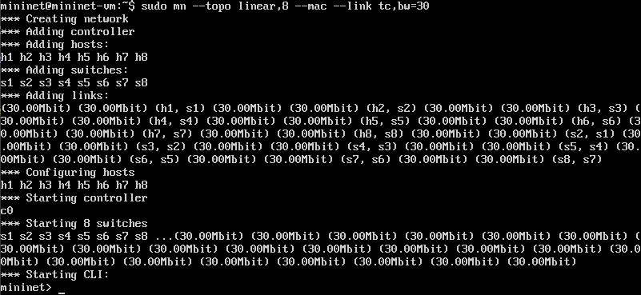

## Inspecionar informações das interfaces, endereços MAC, IP e portas

```sh
    h1 ifconfig
    h2 ifconfig
    ...
    h8 ifconfig
```

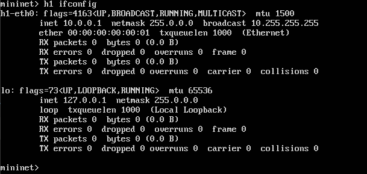
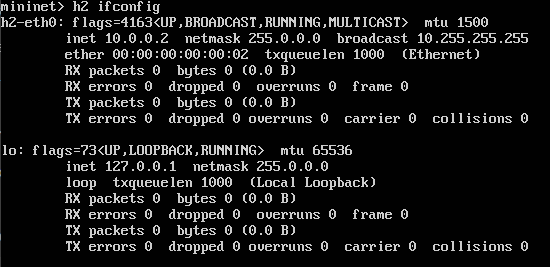
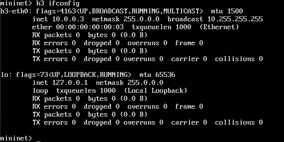
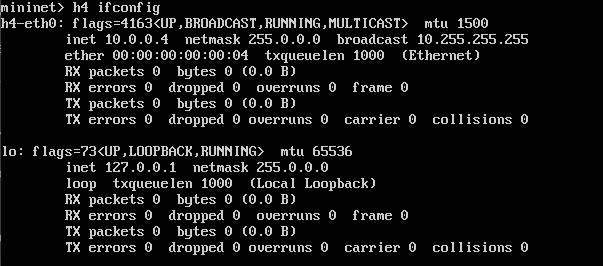
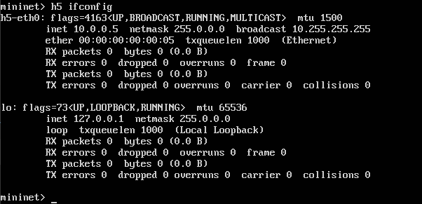

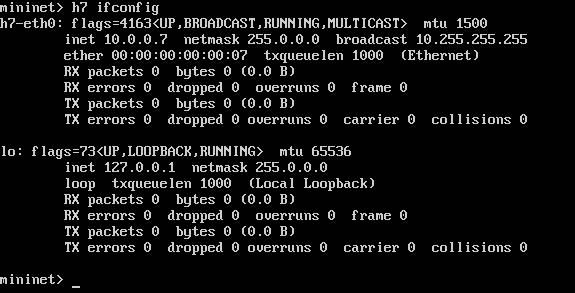
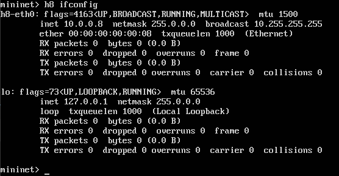

```sh
    nodes
```

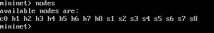

```sh
    net
```

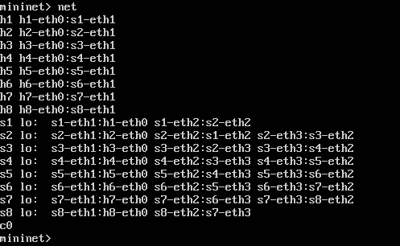

```sh
    dump
```

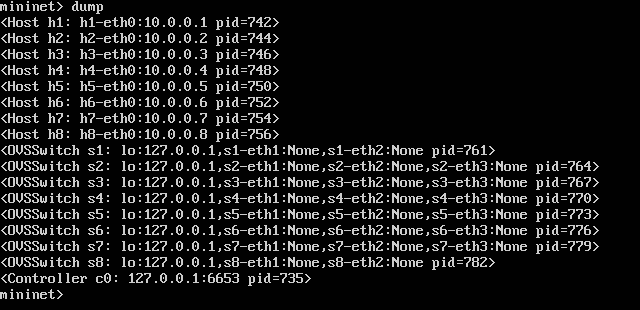

## Desenho ilustrativo da topologia

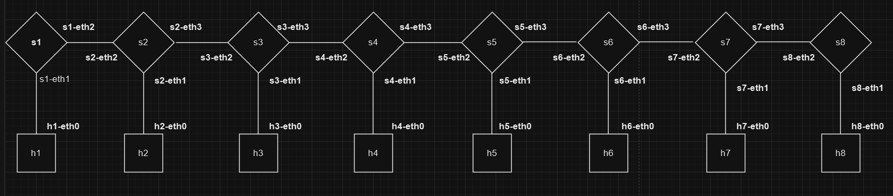

## Testar Conectividade com Ping e tcpdump

3. testando a conectividade entre Host 1 e Host 8.

```sh
    h1 ping h8
```

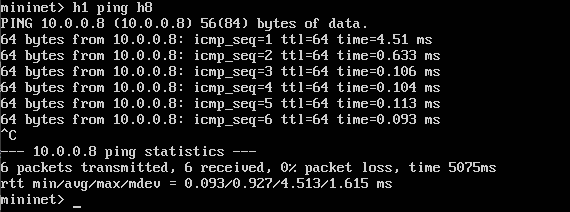

```sh
    h1 tcpdump -n -i h1-eth0
```

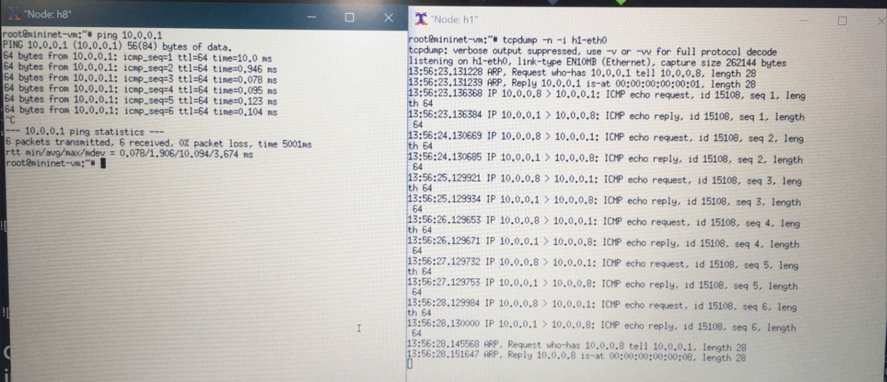

## Configuração do servidor e cliente TCP com iperf

```sh
    h1 iperf -s -p 5555 -i 1
```
```sh
    h2 iperf -c 10.0.0.1 -p 5555 -i 1 -t 15
```

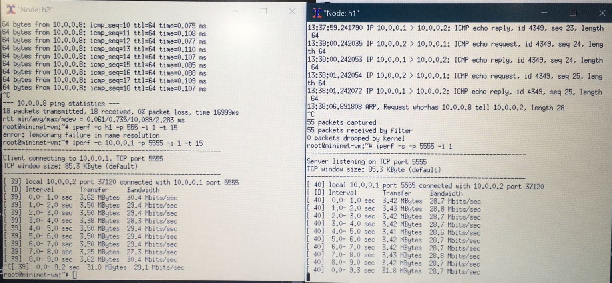

4. Repetindo o teste para diferentes valores de largura de banda:

- largura de banda = 1 Mbps
```sh
    sudo mn --topo linear,8 --mac --link tc,bw=1
    h1 iperf -s -p 5555 -i 1
    h2 iperf -c 10.0.0.1 -p 5555 -i 1 -t 15
```

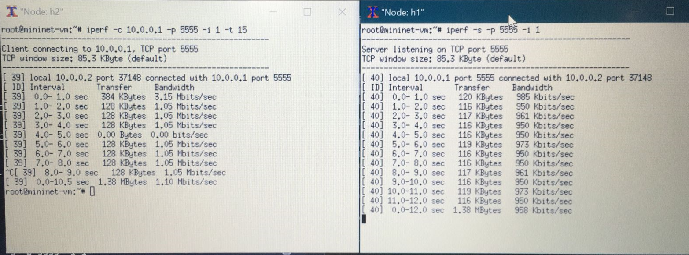

- largura de banda = 5 Mbps
```sh
    sudo mn --topo linear,8 --mac --link tc,bw=5
    h1 iperf -s -p 5555 -i 1
    h2 iperf -c 10.0.0.1 -p 5555 -i 1 -t 15
```

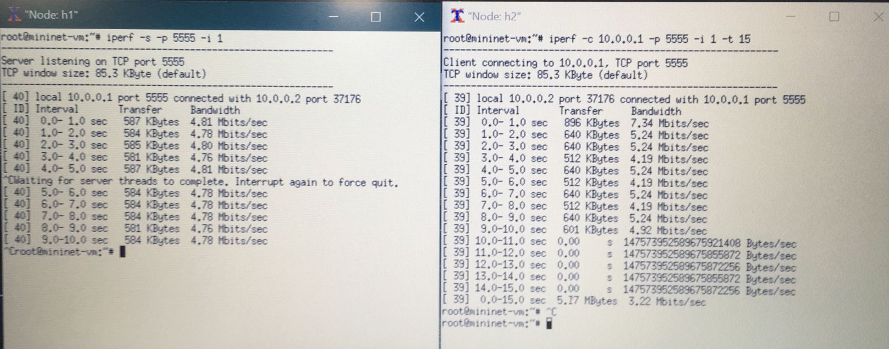

- largura de banda = 10 Mbps
```sh
    sudo mn --topo linear,8 --mac --link tc,bw=10
    h1 iperf -s -p 5555 -i 1
    h2 iperf -c 10.0.0.1 -p 5555 -i 1 -t 15
```

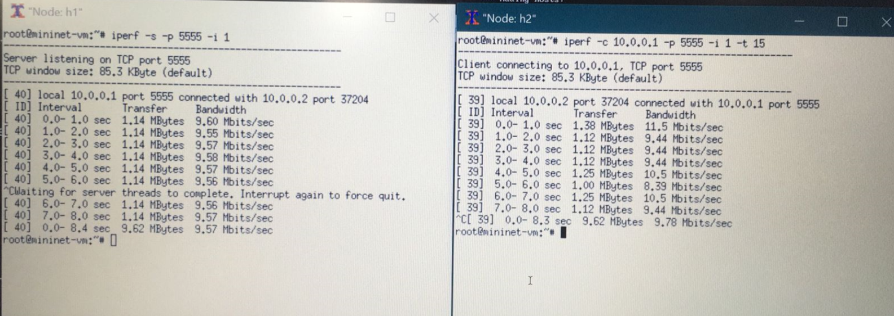

- largura de banda = 15 Mbps
```sh
    sudo mn --topo linear,8 --mac --link tc,bw=15
    h1 iperf -s -p 5555 -i 1
    h2 iperf -c 10.0.0.1 -p 5555 -i 1 -t 15
```

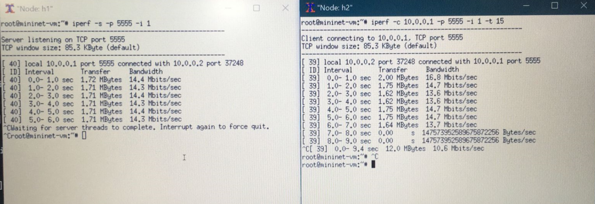

- largura de banda = 20 Mbps
```sh
    sudo mn --topo linear,8 --mac --link tc,bw=20
    h1 iperf -s -p 5555 -i 1
    h2 iperf -c 10.0.0.1 -p 5555 -i 1 -t 15
```

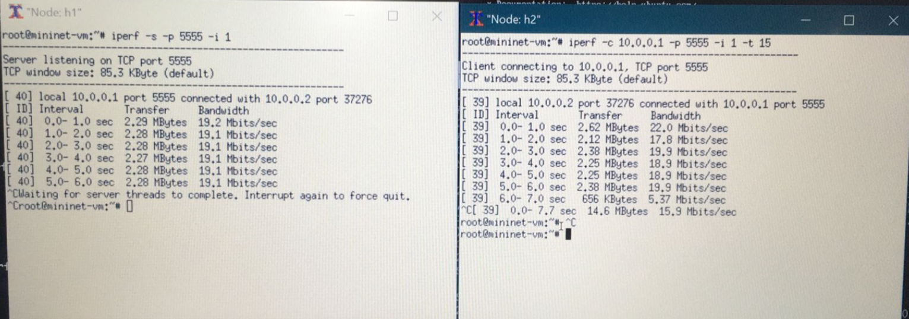

- largura de banda = 25 Mbps
```sh
    sudo mn --topo linear,8 --mac --link tc,bw=25
    h1 iperf -s -p 5555 -i 1
    h2 iperf -c 10.0.0.1 -p 5555 -i 1 -t 15
```

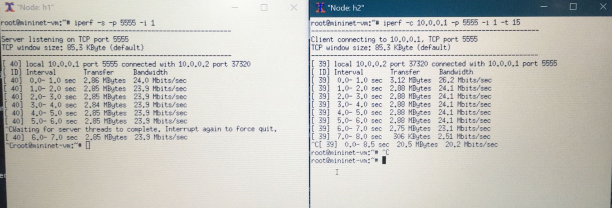

# Questão 2

### Arquivo:
  - `topologia_customizada`

## Desenho ilustrativo da topologia


### Colaboradores
- Leonardo Matias
- Raissa Beatriz

